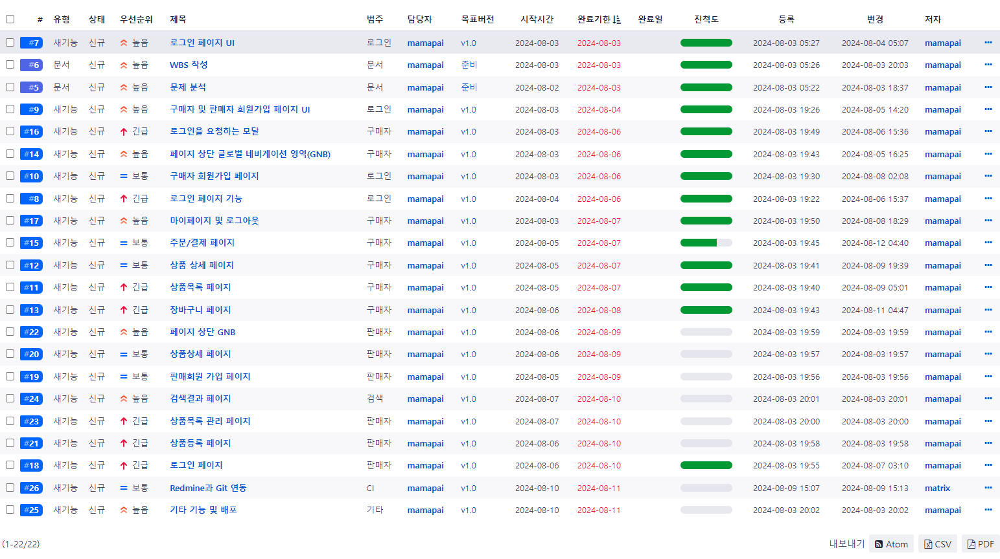

# 오픈마켓 프로젝트

## 프로젝트 개요

오픈마켓 프로젝트는 판매자와 구매자 간의 상호작용을 지원하는 고성능 온라인 쇼핑 플랫폼입니다. 본 프로젝트는 바닐라 JavaScript, HTML, CSS를 기반으로 구축되었으며, 모던 웹 애플리케이션의 필수 기능을 제공합니다. 마이크로서비스 아키텍처를 채택하여, 독립적이고 확장 가능한 서비스 구성을 지향합니다. 이 문서는 프로젝트의 구조, 기능, 기술 스택, API 명세 등 세부 사항을 설명합니다.

## 기술 스택 및 도구

- **프론트엔드**: HTML5, CSS3, JavaScript (Vanilla JS)
- **백엔드 API**: RESTful API (모델링을 위한 가상 API 또는 Mock 서버)
- ReadMind 일정관리와 프로젝트관리 및 버그관리 시스템
- **빌드 및 배포**: Git, Live Server (VSCode)
  

## 주요 기능 및 서비스

### 구매자 기능

1. **인증 및 사용자 관리**

   - **로그인 페이지**

     - URL: `https://auth.example.com/login`
     - 사용자 아이디 및 비밀번호 입력 후 인증
     - 로그인 검증 로직 (API 연동)
     - focus 이벤트 처리
     - 인증 성공 시 이전 페이지로 리다이렉션

   - **회원가입 페이지**

     - URL: `https://auth.example.com/signup`
     - 사용자 정보 입력 및 아이디 중복 확인
     - 약관 동의 체크박스 구현
     - 회원가입 후 로그인 페이지로 리다이렉션

2. **상품 탐색 및 검색**

   - **상품 목록 페이지**

     - URL: `https://products.example.com/`
     - 모든 상품 목록을 조회, 필터링 및 정렬 기능 제공
     - 각 상품에 대한 기본 정보(상품명, 판매자, 가격) 표시
     - 상품 클릭 시 상세 페이지로 이동 로직

   - **상품 상세 페이지**

     - URL: `https://products.example.com/:id`
     - 특정 상품의 상세 정보 제공
     - 수량 선택 및 가격 실시간 계산
     - 바로 구매 버튼을 눌렀을 시, 결제 페이지로 넘어갑니다.
     - 재고 수량을 초과하면 + 버튼이 비활성화됩니다.

3. **쇼핑 카트 관리**

   - **장바구니 페이지**

     - URL: `https://cart.example.com/`
     - 장바구니에 담긴 상품 목록 및 총 금액 계산
     - 모달창에서 상품 수량 변경 및 삭제 기능
     - 재고 수량을 초과하면 + 버튼은 비활성화
     - 장바구니 항목 수정 시 실시간 업데이트

4. **결제 및 주문**

   - **주문/결제 페이지**

     - URL: `https://checkout.example.com/`
     - 주문/결제 페이지에서 상품 정보는 수정 불가합니다.
     - 배송 정보 칸에 주문자 정보와 배송지 정보를 입력할 수 있어야 합니다.
     - 모든 입력이 완료되어야 결제하기 버튼이 활성화됩니다.
     - 결제하기 버튼을 누르면 결제가 진행됩니다.

5. **로그인 요청 모달**

   - 비로그인 사용자는 장바구니, 바로구매를 클릭했을 시 로그인을 해달라는 모달 창이 뜸.

6. **마이페이지 및 로그아웃 기능**

   - 상단 네비게이션에 있는 마이페이지를 클릭하면, 마이페이지,로그아웃 기능이 있는 드롭다운 박스가 생깁니다.
   - 드롭다운 박스에 있는 마이페이지는 UI로만 존재합니다.
   - 드롭다운 박스에 있는 로그아웃을 클릭했을 시, 로그아웃 됩니다.

7. 푸터구현

### 판매자 기능

1. **인증 및 판매자 관리**

   - **판매자 로그인 페이지**

     - URL: `https://seller-auth.example.com/login`
     - 판매자 로그인 검증 로직 구현 (API 연동)
     - 판매회원 로그인 탭을 클릭하면 판매 회원으로 로그인합니다.

2. 판매회원 가입 페이지 구현

   - 사용자 입력 필드 구현 (아이디, 비밀번호, 이메일, 기타 정보)
   - 사업자 등록번호에서 인증 버튼을 눌렀을 때 10개의 숫자가 아니면 입력 창 아래에 경고메세지가 나타납니다.
   - 판매회원 가입 탭을 누르고, 모든 입력을 마친 뒤(이용약관 체크박스 포함) 가입하기 버튼을 누르면 판매자로 회원가입이 됩니다.
   - 회원가입 검증 로직 (API 연동)
   - 회원가입 성공 시 로그인 페이지로 리다이렉션

3. **상품 관리**

   - **상품 등록 페이지**

     - URL: `https://seller-products.example.com/new`
     - 상품 이미지를 등록할 수 있습니다.(상세페이지와 상품목록페이지에서 보이는 이미지)
     - 상품명, 판매가, 기본 배송비, 재고 모두 입력 가능 합니다.(default 값은 모두 0입니다.)
     - 상품명은 20자로 제한됩니다.
     - 저장하기 버튼을 누르면 상품 등록이 완료되며 상품 상세 페이지로 이동합니다.
     - 상품 상세 정보를 입력하는 에디터 영역 기능이 있습니다. (UI를 제공하지 않습니다)

   - **상품 관리 페이지**

     - URL: `https://seller-products.example.com/`
     - 판매자가 등록한 상품 목록 불러오기 (API 연동)
     - 수정 버튼을 누르면 상품 업로드 페이지로 이동하며, 상품 업로드 페이지에 productId 등록한 상품에 해당하는 상품의 내용이 보여집니다.
     - 삭제 버튼을 누르면 삭제를 재확인하는 모달이 나타납니다. 삭제 버튼을 누르면 등록된 상품이 삭제됩니다.

## 프로젝트 구조

```js
/Open-Market-Project

├── /public
│ ├── index.html - 메인 페이지
│ ├── login.html - 구매자 로그인 페이지
│ ├── signup.html - 구매자 회원가입 페이지
│ ├── products.html - 상품 목록 페이지
│ ├── product-details.html - 상품 상세 페이지
│ ├── cart.html - 장바구니 페이지
│ ├── checkout.html - 주문/결제 페이지
│ ├── seller-login.html - 판매자 로그인 페이지
│ ├── seller-products.html - 판매자 상품 관리 페이지
│ ├── seller-product-new.html - 상품 등록 페이지
│ ├── /css - 스타일시트
│ ├── /js - 자바스크립트 파일
│ ├── /images - 이미지 파일
│ └── /assets - 기타 자산
└── README.md - 프로젝트 설명
```

## 설치 및 실행

1.  **프로젝트 클론**

    bash
    git clone https://github.com/damoayo/Open-Market-Service
    cd open-market-project

2.  **라이브 서버 실행**

    VSCode를 사용하는 경우, "Live Server" 확장 프로그램을 사용하여 index.html을 실행

## API 명세서

- **인증 서비스**

  - 로그인: POST https://auth.example.com/api/login
  - 회원가입: POST https://auth.example.com/api/signup

- **상품 서비스**

  - 상품 목록: GET https://products.example.com/api/products
  - 상품 상세 정보: GET https://products.example.com/api/products/:id

- **장바구니 서비스**

  - 장바구니 추가/수정: POST https://cart.example.com/api/cart

- **결제 서비스**

  - 주문/결제: POST https://checkout.example.com/api/checkout

- **판매자 서비스**

  - 상품 등록: POST https://seller-products.example.com/api/products
  - 상품 관리: GET https://seller-products.example.com/api/products
  - 주문 관리: GET https://seller-orders.example.com/api/orders

**모델링 및 요구사항 명세**

```js
classDiagram

    class User {
        +int id
        +string username
        +string password
        +string email
        +string role
        +login()
        +register()
    }

    class Product {
        +int id
        +string name
        +float price
        +string description
        +int stock
        +string imageUrl
        +getDetails()
    }

    class Cart {
        +int id
        +map~Product, int~ items
        +addItem(Product, int quantity)
        +removeItem(Product)
        +calculateTotal()
    }

    class Order {
        +int id
        +User user
        +Cart cart
        +string status
        +createOrder()
        +cancelOrder()
    }

    User "1" -- "0..*" Order
    User "1" -- "0..1" Cart
    Product "1" -- "0..*" Cart
    Cart "1" -- "1" Order
```

- **요구사항 상세**

  -User -속성: id, username, password, email, role (구매자/판매자 구분) -기능: 로그인, 회원가입
  -Product -속성: id, name, price, description, stock, imageUrl -기능: 상품 상세 정보 제공
  -Cart -속성: id, items (상품과 수량의 매핑) -기능: 상품 추가/삭제, 총액 계산
  -Order -속성: id, user, cart, status -기능: 주문 생성 및 취소

- **라이센스**

  참고 및 출처 - 주식회사 위니브

- **프로젝트 기여자**

  [FE]지명진 - 프로젝트 개발 및 유지보수
